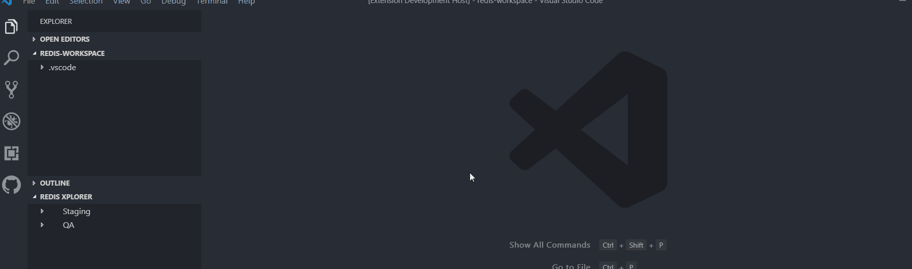
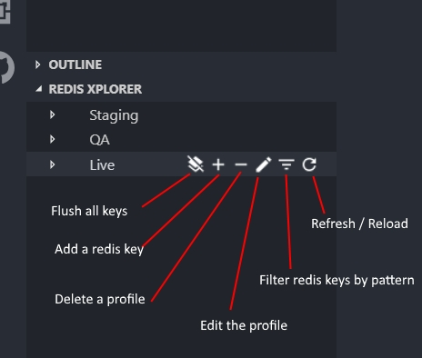
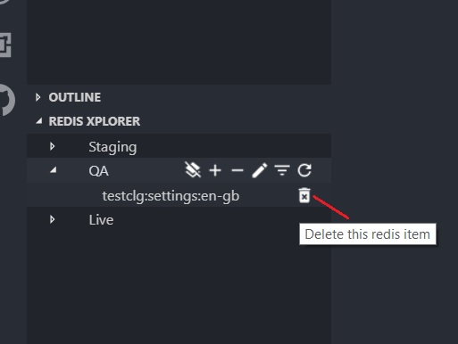
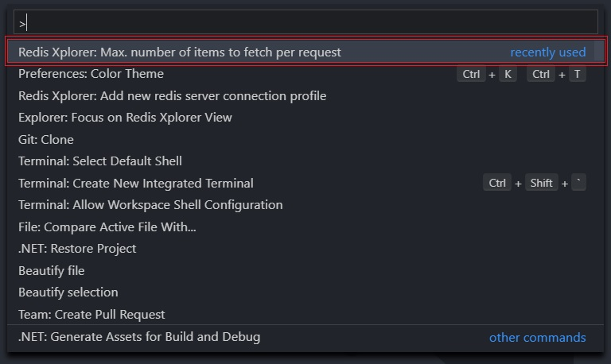

# Redis Xplorer

Redis Xplorer is a Visual Studio Code extension that allows you to manage Redis values with ease. Using this extension, you can

- Create, edit & maintain multiple redis connection profiles

- View Redis server connection information

- Read, edit and save Redis values from within VS editor with all supported language features.

- Filter Redis keys & focus on required items using text pattern e.g., `example*`.

## Setup a new connection profile

1. Select `Redis Xplorer : Add new redis server connection profile` from the command palette.

2. Provide a name for the connection profile.

3. Provide a host server name for the connection

4. Next, default port number (`:6379`) is shown. You can modify that to 6380 for SSL support.

5. Provide an access key for authentication.

6. On completion, this new redis connection will be added to the Redis Xplorer dock window.

## Action available on Connection Profile

1. Add a new redis item under selected profile

2. Edit the connection profile

3. Delete the selected profile

4. Filter redis keys using pattern

5. Flush / delete all redis keys under a profile

6. Refresh or reload all keys

## Action available on Redis item

1. On selecting a redis item, the value is loaded in the text pane. Then, the contents can be edited and saved using `save (ctrl + s)` command

2. Individual redis item can be deleted by clicking on the trash icon that appears while hovering on item.

## Performance consideration

Using Redis - `Keys()` method to retrieve all keys (i.e., millon or more keys) on production environment will result in performance issue due to blocking nature of long running request on Single threaded Redis server. So, latest Redis offers methods like `scan()` or `scanStream()` to query Redis items incrementally in a paginated way i.e., by requesting `n` items on each request.

The number of items to query on each request can be configured based on your Redis server capacity by accessing `Redis Xplorer: Max. number of items to fetch per request` from the command palatte (`Ctrl + Shift + P`).

## Configurations

This extension persists all your configured connection profiles, under currently opened folder/workspace.

i.e., using `.vscode/settings.json`.

### JSON Schema for configuration

~~~~xml
{
  "title": "Redis Xplorer Configuration",
  "properties": {
    "redisXplorer.config": {
      "type": "object",
      "description": "Redis server connection configuration & profiles",
      "properties": {
        "scanLimit": {
          "type": "number",
          "description": "Number of items to scan on each request to Redis server"
        },
        "profiles": {
          "type": "array",
          "description": "Redis connection profiles",
          "items": {
            "type": "object",
            "properties": {
              "name": {
                "type": "string",
                "description": "Profile nick name"
              },
              "host": {
                "type": "string",
                "description": "Redis server/host name"
              },
              "accessKey": {
                "type": "string",
                "description": "Password to authenticate"
              },
              "filter": {
                "type": "string",
                "description": "Pattern to filter redis keys"
              },
              "port": {
                "type": "string",
                "description": "Port number to connect on the Redis server"
              }
            }
          }
        }
      }
    }
  }
}
~~~~

## Support

- Have any suggestion ?
- Found an annoying bug ?
- Miss any essential feature ?

Kindly raise it as an issue [over here](https://github.com/davidsekar/Redis-Xplorer/issues). I'll try my best to address all your support queries and issues as early as possible.

If you wish to thank me or support this extension development!

Thanks for using this extension.
